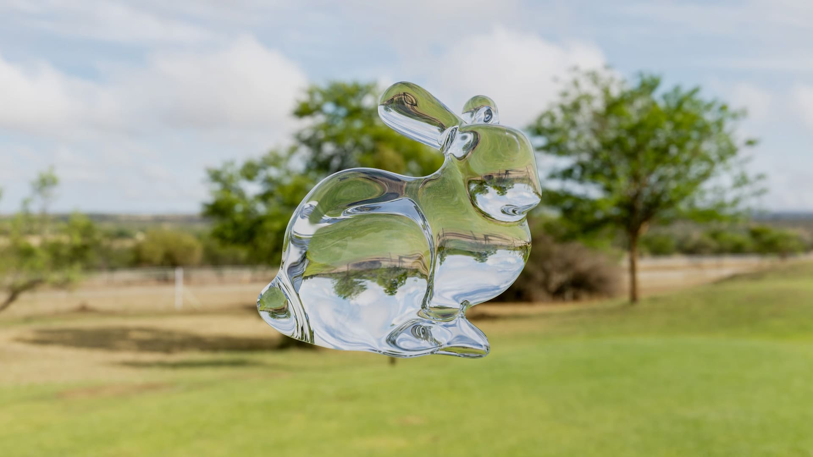
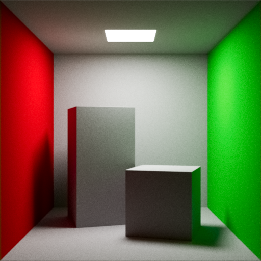
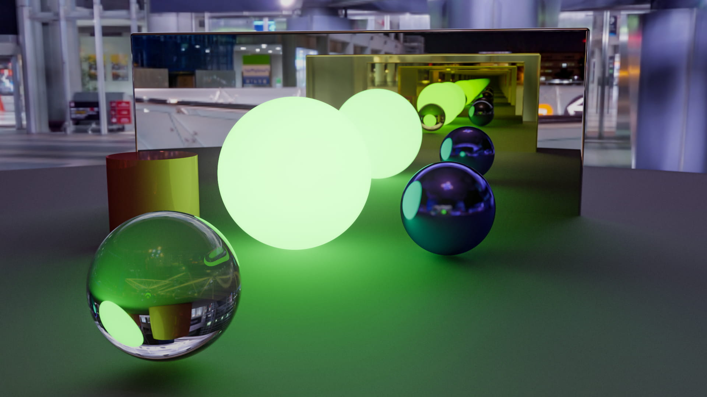

# Taichi Simple PBR Path Tracer

||||
|:-:|:-:|:-:|
|[SDF Bunny](./examples/bunny/bunny_sdf_glass.py)|[Cornell Box](./examples/cornell_box/cornell_box_shortest.py)|[Tokyo IBL](./examples/scene_demo/tokyo_ibl.py)|

## Install

```shell
pip install taichi -U
```

## Run

```shell
ti index.py -ibl
```

## More

- https://github.com/HK-SHAO/RayTracingPBR/tree/taichi
- https://github.com/HK-SHAO/RayTracingPBR/tree/shadertoy
- https://github.com/HK-SHAO/RayTracingPBR/tree/main

## Reference

- https://erleuchtet.org/~cupe/permanent/enhanced_sphere_tracing.pdf
- https://graphics.pixar.com/library/OrthonormalB/paper.pdf
- https://hal.science/hal-02507361/document
- https://iquilezles.org/articles/