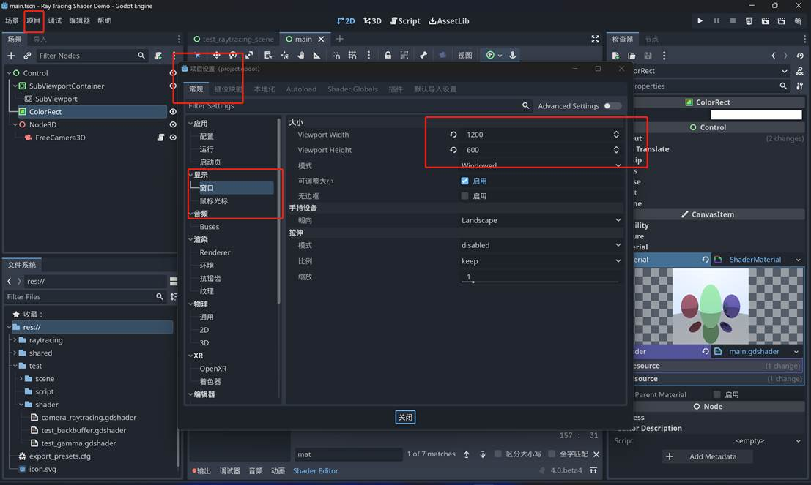
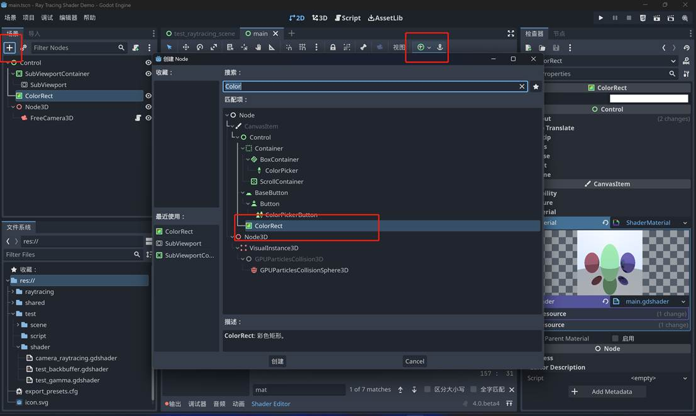
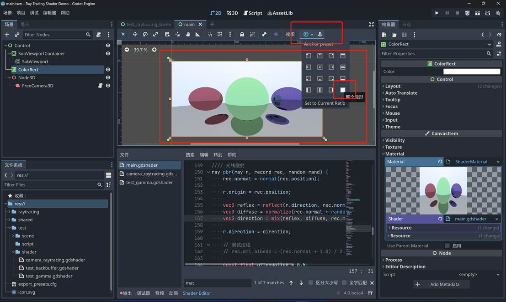
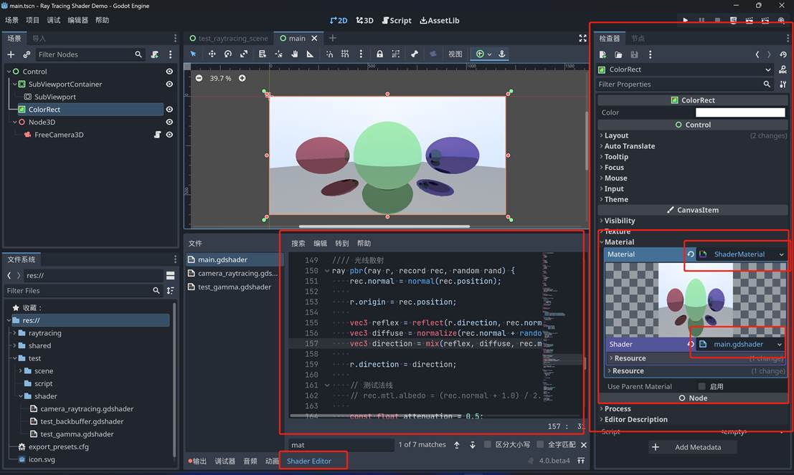

# Ray Tracing PBR

大概计划项目过程：
-    先写 GLSL 实现，使用 Godot 编辑 GLSL 代码（因为我已经写好了摄像机控制和降噪）
-    移植 Shader 代码到 Taichi
-    预计完成时间两周

项目内容：
-    支持 PBR 、 Ray Marching 的光线追踪渲染器，支持 SDF 地图
-    简单地编一下，屏幕画面后处理、加几个简单动画（程序性动画）

 

 

下载 godot4 [Index of /godotengine/4.0/beta4/ (downloads.tuxfamily.org)](https://downloads.tuxfamily.org/godotengine/4.0/beta4/)

https://downloads.tuxfamily.org/godotengine/4.0/beta4/

 

最新的代码：[Godot Ray Tracing Shader (github.com)](https://gist.github.com/HK-SHAO/2dbb8c717fb3fb137c5cd97a456d659d)

https://gist.github.com/HK-SHAO/2dbb8c717fb3fb137c5cd97a456d659d

 

新建一个项目，更改画布长宽比率为 2:1

 

新建一个场景，放一个 ColorRect 

 

 

设置为全屏大小

 

 

材质赋予 Shader Material ，然后就可以编辑代码了（把代码贴进去）

