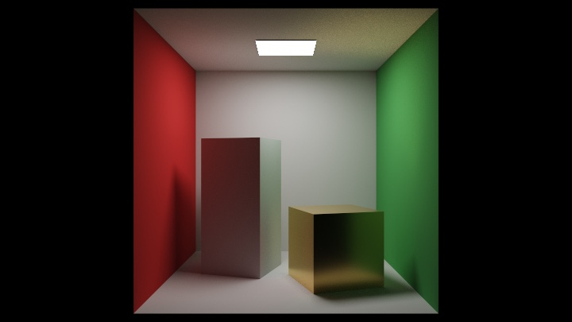
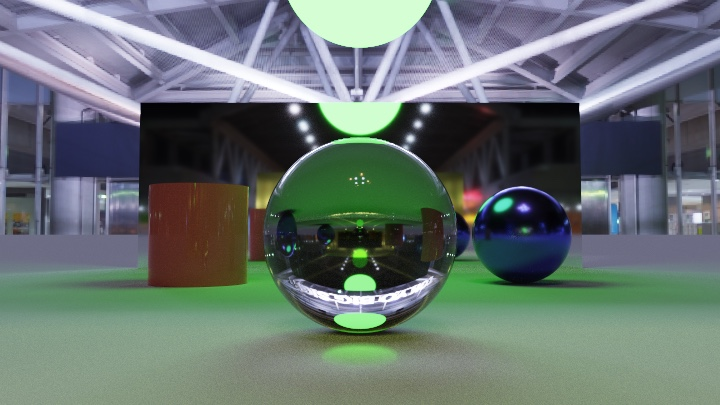
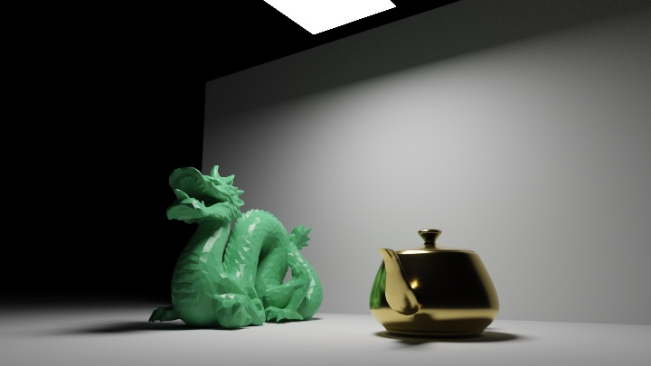

# RayTracingPBR

WebGPU MIS path tracer.

||||
|:-:|:-:|:-:|
|Cornell|Studio|Dragon|

## Install

```shell
bun install
```

## Run

```shell
bun run dev
```

```shell
bun run check
bun run test
bun run build
```

## More

- https://github.com/HK-SHAO/RayTracingPBR/tree/taichi-dev
- https://github.com/HK-SHAO/RayTracingPBR/tree/shadertoy

## Reference

- https://erleuchtet.org/~cupe/permanent/enhanced_sphere_tracing.pdf
- https://graphics.pixar.com/library/OrthonormalB/paper.pdf
- https://hal.science/hal-02507361/document
- https://iquilezles.org/articles/
