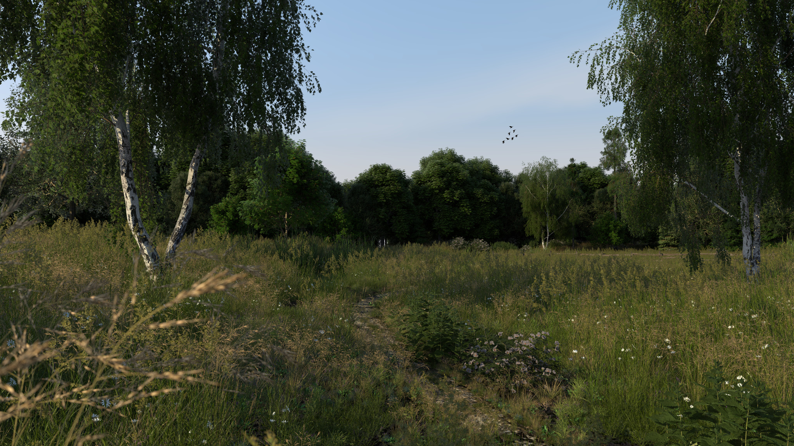
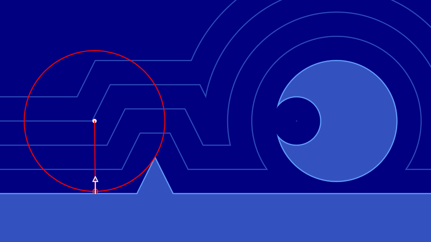

# Taichi: 从零开始的光线追踪

::: info
- 本文是追光小队为 Taichi Hackathon 2022 所写
- GitHub 仓库在 https://github.com/HK-SHAO/RayTracingPBR
- 在线效果演示 [raytracing.shao.fun](https://raytracing.shao.fun)
:::

::: warning
三天极限开发，爆肝写文，笔者也只是业余爱好者，本文可能会有诸多纰漏和错误，真诚期望读者能在评论区指出，谢谢啦！
:::


::: center
用 Taichi 渲染 100 万面镜子
:::

::: details Bilibili 视频
<BiliBili bvid="BV17v4y1o7GA" />
:::
## 前言

这篇文章会分若干章节，教你使用并行计算框架 Taichi 来从零开始、一步一步地实现一个基于物理 (Physically Based Rendering, PBR) 的光线追踪渲染器，然后用它构建一个场景，渲染出有真实感的画面。这篇文章基于实践，但是仍然会尽可能的用更多自然语言、图和公式讲解其中的物理和数学原理。

::: details 查看目录
[[toc]]
:::


### 什么是并行计算

正如我前面所说，Taichi 是一个并行计算框架，当前许多计算密集型任务（例如图像渲染、物理仿真和人工智能等任务）高度依托于并行计算。为什么呢，因为这些任务都可以被分解为可以被并行处理的最简单的数学运算，通常我们会把它们交给多核心的 CPU 或 GPU 来进行处理。

如何区分 CPU 和 GPU ？形象点来说，CPU 的若干个大核心就像是几个博士为你处理任务，而 GPU 就像是有成百上千个小学生（英伟达的 4090 GPU 拥有超过一万个 CUDA 核心）为你同时处理任务。所以通常，我们会使用 GPU 来加速并行计算。

::: center
  
GPU 拥有大量处理单元，可以同时处理大量任务[^tbos]
:::

[^tbos]: The Book of Shaders. https://thebookofshaders.com/

### 为什么用 Taichi

我高三和大一的时候曾构想过一个专门进行数值计算和可视化的工具 Plotter ，它将循环和分支结构视为对矩阵的处理，并且当时使用 JavaScript 实现了这个工具的原型，创作了一些简单的数学可视化效果。

|||
|:-:|:-:|
|高中和大学的时候做的一些数学绘图小玩具|用我自己写的小工具画的 Julia 集|

但是它的问题是效率非常低下。后来我接触了游戏开发，并入门了着色器，然后震惊于并行计算带来的极高计算效率，但是使用着色器任然存在许多桎梏，它的兼容性和灵活度并不是很好。

再后来我了解了 Taichi ，作为领域特定语言，能够让你以更好的灵活度和简便的语法轻松玩转并行编程，无需配置复杂的 C++/CUDA 环境、使用冗长的语法并处理各种编译和运行时问题。

下面是一段 Taichi 代码的示意图，相信你能从其中感受到 Taichi 的简洁和灵活性。

::: center

:::

::: center

用蒙特卡洛算法计算圆周率  
图片来自 Taichi 官网 [taichi-lang.org](https://www.taichi-lang.org/apps/python-code.svg)

:::

### 并行离我们远吗

并不远！并行计算时时刻刻都在发生，包括我们每天在看的视频、玩的游戏都需要经过大量并行计算。而多媒体创作本身，例如我们在使用相机拍下照片的瞬间、用剪辑软件或特效软件处理视频、影视特效对物体的仿真和渲染、AI 模型的训练和使用（相信不少人已经了解了由 Novel AI 和 niji·journey 等 AI 模型创作的不少令人惊人的画作）等等也需要大量并行计算的任务。

|||
|:-:|:-:|
|你能一眼分辨出这是 AI 画的吗？|你能一眼分辨出这是游戏渲染的吗？[^pbrbook]|

[^pbrbook]: Physically Based Rendering:From Theory To Implementation. https://www.pbr-book.org/

## 如何使用 Taichi

Taichi 是一门开源的、嵌入在 Python 中的并行编程语言。在开始之前，你需要先安装 Python ，然后使用 Python 的包管理器 `pip` 来安装 Taichi 。

::: tip
在安装 Python 时，记得勾选 `Add Python 3.x to PATH` 选项，这样你就可以在任意路径下使用 `python` 命令来启动 Python 了
:::

在 [Python 官网](https://www.python.org/) 下载安装 Python 后，使用 `pip` 安装 Taichi 。

```bash
pip install taichi -U
```

之后，你可以使用下面的命令来验证是否安装成功，并查看一些 taichi 程序的演示。

```bash
ti gallery
```

### Taichi 速查表

::: info
- 这份速查表[^cheatsheet]来自 Taichi 开发团队的 GitHub 仓库，它可以帮助你快速了解 Taichi 的基本语法
- 我为它创建了一个可在线查看的 SVG 版本，你可以在这里获取 [Taichi Lang Cheatsheet SVG](/blog/p/taichi-lang-cheatsheet-svg.md)
:::

[^cheatsheet]: Taichi Language Cheatsheet. https://github.com/taichi-dev/cheatsheet

::: center
  
Taichi 语言速查表
:::

::: tip
你现在可能并不需要清楚每一个函数背后的意义。在后面的教程中，你会逐渐了解它们的一部分，然后完成一个光线追踪渲染器
:::

### 运行 Taichi 程序

现在，我会教你使用 Taichi 定义一个向量场，然后使用 GPU 绘制一片紫色并显示在窗口中。

你也许已经知道，显示设备显示图像的原理是每个像素以混合不同强度的红绿蓝 (RGB) 三色光的方式[^rgbmod]显示五彩斑斓的颜色，而在计算机中也最常用 RGB 色彩空间来处理颜色。紫色是由红色光与蓝色光混合而成，绿色光的强度为 0 ，所以我们用 `vec3(1, 0, 1)` 表示紫色。

[^rgbmod]: RGB color model. https://en.wikipedia.org/wiki/RGB_color_model

::: center
  
放大看显示器，实际上是由 RGB 像素构成的[^rgbmod]
:::

我们将图像视为一个二维的、由像素组成的向量场[^vecf]，每个像素都有一个颜色值，用一个三维的向量表示 RGB 三个分量的强度，且每个分量被标准化到 0 和 1 之间，用 0 表示强度最弱，用 1 表示强度最强。在 Taichi 中，我们先用 `ti.init(arch=ti.gpu)` 初始化 Taichi ，并告诉它我们要将程序在 GPU 中加速运行，然后使用 `ti.Vector.field` 来定义一个向量场。

[^vecf]: Vector field. https://en.wikipedia.org/wiki/Vector_field

这个场的大小便是图像的分辨率，在这里我们设置为常见的 `1920x1080` ，即 1920 个像素宽、1080 个像素高的图像。然后，我们在用 `ti.kernel` 装饰 Taichi 运行时的入口（这里是 `render` 函数），使用 Taichi 的并行 `for` 为每个像素赋予紫色 `vec3(1, 0, 1)` 。最后我们用 `ti.ui.Window` 创建一个窗口[^tiggui]，并用 `canvas.set_image` 将这个场绘制到窗口的画布中。

创建一个 `00.py` 文本文件，输入下面的代码。

```python
from taichi.math import *   # 导入 Taichi 数学库
import taichi as ti # 导入 Taichi 库

ti.init(arch=ti.gpu)    # 初始化 Taichi ，GPU 加速

image_resolution = (1920, 1080) # 图像分辨率
image_pixels = ti.Vector.field(3, float, image_resolution) # 图像的像素场

@ti.kernel
def render():   # 渲染函数
    for i, j in image_pixels:   # 并行遍历像素场
        image_pixels[i, j] = vec3(1, 0, 1)  # 设置像素颜色为紫色

window = ti.ui.Window("Taichi Renderer", image_resolution)  # 创建窗口
canvas = window.get_canvas()    # 获取画布

while window.running:
    render()    # 调用渲染函数
    canvas.set_image(image_pixels)  # 为画布设置图像
    window.show()   # 显示窗口
```

在当前路径下，使用终端命令 `ti 00.py` 运行这个 Taichi 程序，你便可以看到一个紫色的窗口。


::: center
  
你的第一个 Taichi 图形程序：紫色的窗口
:::

::: info
- 到这一步的完整代码在 GitHub
- https://github.com/HK-SHAO/RayTracingPBR/blob/taichi/taichi/RT01/00.py
:::

## 让我们正式开始

别忘了我们的目标是创建一个光线追踪渲染器，但是凡事都得一步一步地来不是吗？现在你已经会运行 Taichi 程序，并成功在画布里绘制出了一片纯紫色，这已经是一个很好的开始了。

接下来我们要建立坐标系，并对坐标值进行归一化，这是我们能够自由控制画面中物体位置的基础。

什么是归一化？通常是指将数值压缩到 0 到 1 之间，或者 -1 到 1 之间。在这里，我们的图像分辨率是 `image_resolution = (1920, 1080)` ，但这个数值是可以被我们自由变更的，因此我们将第 i 行、第 j 列的像素的坐标值归一化为 `u = i / image_resolution[0]` 和 `v = j / image_resolution[1]` ，这样我们就可以使用归一化的 uv 坐标来描述像素位置了。

之后，我们将红色强度设置为 u ，绿色强度设置为 v ，蓝色强度设置为 0 ，这样我们就可以看到一个渐变的彩色图像，并且沿着 u 轴从左到右红色强度上升，沿着 v 轴从下到上绿色强度上升。

::: center
  
彩色的画布，沿着 u 轴从左到右红色强度上升，沿着 v 轴从下到上绿色强度上升
:::

创建一个 `01.py` 文本文件，在 `00.py` 基础上加入下面的代码。

```python{12-15}
from taichi.math import *   # 导入 Taichi 数学库
import taichi as ti # 导入 Taichi 库

ti.init(arch=ti.gpu)    # 初始化 Taichi ，GPU 加速

image_resolution = (1920, 1080) # 图像分辨率
image_pixels = ti.Vector.field(3, float, image_resolution) # 图像的像素场

@ti.kernel
def render():   # 渲染函数
    for i, j in image_pixels:   # 并行遍历像素场
        u = i / image_resolution[0] # 计算归一化的 u 坐标
        v = j / image_resolution[1] # 计算归一化的 v 坐标

        image_pixels[i, j] = vec3(u, v, 0)  # 设置像素颜色

window = ti.ui.Window("Taichi Renderer", image_resolution)  # 创建窗口
canvas = window.get_canvas()    # 获取画布

while window.running:
    render()    # 调用渲染函数
    canvas.set_image(image_pixels)  # 为画布设置图像
    window.show()   # 显示窗口
```

在当前路径下，使用终端命令 `ti 01.py` 运行这个 Taichi 程序，你便可以看到一个彩色的窗口。

::: info
- 到这一步的完整代码在 GitHub
- https://github.com/HK-SHAO/RayTracingPBR/blob/taichi/taichi/RT01/01.py
:::

## 使画面动起来

一副静态画面有什么好看的呢？让我们更进一步，使画面动起来吧。

我们需要做的是获取当前程序运行经过的时间，然后将这个时间传入 `render` 函数，让它影响蓝色分量的强度。我们希望画面整体蓝色强度会随着时间周期性的变化。

别忘了归一化，程序经过的时间是以秒为单位不断增加的，但是我们的蓝色分量必须在 0 和 1 之间，在这之外的值会被截断。因此，我们使用 $\sin(t)$ 函数将时间归一化到 -1 到 1 之间，然后将其缩放并平移到 0 到 1 之间，这只需要 $0.5 * \sin(t) + 0.5$ 。

创建一个 `02.py` 文本文件，在 `01.py` 基础上加入下面的代码。

```python{11,16-17,22-25}
from taichi.math import *   # 导入 Taichi 数学库
import taichi as ti # 导入 Taichi 库
import time # 导入时间库

ti.init(arch=ti.gpu)    # 初始化 Taichi ，GPU 加速

image_resolution = (1920, 1080) # 图像分辨率
image_pixels = ti.Vector.field(3, float, image_resolution) # 图像的像素场

@ti.kernel
def render(time: float):   # 渲染函数
    for i, j in image_pixels:   # 并行遍历像素场
        u = i / image_resolution[0] # 计算归一化的 u 坐标
        v = j / image_resolution[1] # 计算归一化的 v 坐标

        blue = 0.5 * sin(time) + 0.5 # 计算蓝色分量
        image_pixels[i, j] = vec3(u, v, blue)  # 设置像素颜色

window = ti.ui.Window("Taichi Renderer", image_resolution)  # 创建窗口
canvas = window.get_canvas()    # 获取画布

start_time = time.time()    # 获取程序开始时时间
while window.running:
    delta_time = time.time() - start_time   # 计算时间差
    render(delta_time)  # 调用渲染函数
    canvas.set_image(image_pixels)  # 为画布设置图像
    window.show()   # 显示窗口
```

在当前路径下，使用终端命令 `ti 02.py` 运行这个 Taichi 程序，可以看到一个不断变化色彩的窗口。

::: center
  
这副画面的色调会随着时间周期性变化
:::

::: info
- 到这一步的完整代码在 GitHub
- https://github.com/HK-SHAO/RayTracingPBR/blob/taichi/taichi/RT01/02.py
:::

## 光子与光线

光线追踪渲染利用了光路可逆的原理，我们将光的传播逆向表达，从每个像素发出光线，光击中材质表面后改变了自身的强度、颜色和方向，然后继续传播，直到光线被完全吸收或者到达了光源。最后我们将累积的颜色显示在这个像素上，便渲染出了场景。

接下来，我们来到了光线追踪最基础的一步——定义光线。光线是光子沿射线传播的路径，在基于光线追踪的渲染器中，我们假定光线仅沿着一条直线传播，因此光线可以用一个起点 $\vec{\mathbf{ro}}$ 和一个方向 $\vec{\mathbf{rd}}$ 来表示，其中 $\vec{\mathbf{rd}}$ 应是一个单位向量。这样，光子在三维空间中所在的位置可以用 $\vec{\mathbf{p}}(t)=\vec{\mathbf{ro}} + t \cdot \vec{\mathbf{rd}}$ 表示，其中 $t$ 是光从起点开始传播的距离。

另外，用一个四维向量 `vec4` 表示光线的颜色和强度，这方便我们后面对光的处理。在这里，我们使用面向对象 (OOP) 的建模方法，利用 Taichi 的 `ti.dataclass` 装饰器写一个光线类，`at` 函数传入 `t` 计算光所在位置。

```python
@ti.dataclass
class Ray:  # 光线类
    origin: vec3    # 光线起点
    direction: vec3 # 光线方向
    color: vec4     # 光的颜色

    @ti.func
    def at(r, t: float) -> vec3: # 计算光子所在位置
        return r.origin + t * r.direction
```

## 建立坐标系

为什么要建立坐标系？因为接下来我们要在虚拟的三维空间中定义我们摄像机的位置，在这之前，我们已经用 uv 坐标建立了一个二维的坐标系了，我们还需要一个 z 轴正方向。使用过三维软件、游戏引擎的同学可能知道，图形学中常使用左手系来建立三维空间坐标。

因此，从屏幕向你眼睛的方向，z 轴分量是负的。我们将视点（好比眼睛的位置）放在原点 $(0,0,0)$ ，画布（相当于你的屏幕）的中心位置设置为 $(0,0,-1)$，然后从视点向画布中每个像素发射一条光线。

::: center
  
建立左手系坐标系，将画布放到 z 负半轴方向
:::

在 `render` 函数中，初始化视点和画布的位置，然后创建一条光线。在这里，我们使用了 `normalize` 函数将向量化为仅表示方向的单位向量。

$$
\mathrm{normalize}(\vec{\mathbf{p}})=\frac{\vec{\mathbf{p}}}{\|\vec{\mathbf{p}}\|}
$$

```python
lower_left_corner = vec3(-2, -1, -1)    # 视野左下角
horizontal = vec3(4, 0, 0)  # 视野水平方向
vertical = vec3(0, 2, 0)    # 视野垂直方向
origin = vec3(0, 0, 0)      # 视点

ro = origin # 光线起点
rd = normalize(lower_left_corner + u*horizontal + v*vertical - ro)  # 光线方向
ray = Ray(ro, rd)   # 创建光线
```

## 画一片蓝天

有了光线之后，我们尝试使用光线方向的 y 分量来混合白色和蓝色，从而得到一片随时间变化的蓝天。`mix` 函数是对向量的插值（混合），用数学公式表达是
$$
{\rm mix}(\vec{\mathbf{a}}, \vec{\mathbf{b}}, t)=(1-t)\cdot\vec{\mathbf{a}}+t\cdot\vec{\mathbf{b}}
$$

用 `ti.func` 装饰这个函数是一个 Taichi 函数，这样我们才可以在 Taichi 的 `ti.kernel` 中使用它。

```python
@ti.func
def sky_color(ray, time) -> vec3:
    t = 0.5 * ray.direction.y + 0.5 # 将 y 分量归一化
    blue = 0.5 * sin(time) + 0.5    # 计算蓝色分量
    return mix(vec3(1.0, 1.0, blue), vec3(0.5, 0.7, 1.0), t)    # 混合两种颜色
```

在 `render` 函数中，我们将光线传入 `sky_color` 函数，得到背景颜色，再将背景颜色赋值给像素。

```python
ray.color.rgb = sky_color(ray, time)    # 获取天空颜色
image_pixels[i, j] = ray.color.rgb  # 设置像素颜色
```
::: center
  
一片渐变的蓝天，随时间改变颜色
:::

::: info
- 到这一步的完整代码在 GitHub
- https://github.com/HK-SHAO/RayTracingPBR/blob/taichi/taichi/RT01/03.py
:::

## 往地图放入物体

### 符号距离场函数

接下来我们要往虚拟世界里放入一些几何物体，最简单的物体是一个半径为 $r$ 的球，我们可以使用一个函数来表示这个球，这个函数称为符号距离场函数 (Signed Distance Field，SDF) 。 它表示的是某点到物体表面的距离，如果距离为负数，表示这个点在物体内部，如果距离为正数，表示这个点在物体外部，如果距离为零，表示这个点刚好在物体表面上。

用 $\left\|\vec{\mathbf{p}}\right\|$ 表示向量 $\vec{\mathbf{p}}$ 的 $L_2$ 范数，即

$$
\left\|\vec{\mathbf{p}}\right\|=\sqrt{\vec{\mathbf{p}}\cdot\vec{\mathbf{p}}}
$$

球的 SDF 函数是到球心的距离减去球半径，即

$$
{\rm sphere}(\vec{\mathbf{p}}, r) = \left\|\vec{\mathbf{p}}\right\| - r
$$

使用 SDF 表示物体的好处是，我们可以很方便地计算出物体的表面法线，这在后面的光照计算中会用到。此外， SDF 函数不仅能够表达简单的集合物体，也可以表达复杂的物体，还可以使用简单的运算对多个物体进行变换、组合和重复等操作，这使得我们可以很方便地创建出复杂的场景。

```python
@ti.func
def sd_sphere(p: vec3, r: float) -> float:  # SDF 球体
    return length(p) - r
```

### 光线步进求交

有了用 SDF 表示的球体之后，接下来就是让光线前进，然后找到光线与物体最近的交点。我们可以使用光线步进 (Ray Marching) 的方法来找到交点，即沿着光线方向，每次前进一小步，然后计算出这一步的有向距离 (SD) 值，一直前进直到 SD 值与 0 相差非常小 `abs(SD) < PRECISION` ，就认为光线到达了物体的表面。

可是每次前进的步长是多少呢？如果步长太大，光线可能会跳过物体表面，如果步长太小，光线前进的速度就会极慢，这样就会带来非常多冗余的计算，使得画面帧数下降。

一个聪明的做法是让光线每次前进的距离刚好等于 SD 的绝对值，因为它是当前点到物体表面的最短距离。最好的情况下，光线只需要前进一两次就可以刚好到达表面。

当光线偏离物体很远时，光线也很快就会传播到无穷远处，当光线步进的距离足够远而仍然没有到达物体表面，就认为这条光线没有击中任何物体，那我们就可以认为它击中了天空。

下面是三维空间的一个二维切面，可视化这个算法中光线步进和与物体求交的过程。

::: center
|||
|:-:|:-:|
|较好的情况下很快到达物体表面|没有交点的情况很快就发散|

图片截取自 https://www.shadertoy.com/view/lslXD8
:::

一种比较差的情况是，光线刚好与物体擦肩而过，这个时候步进次数会急剧上升，不过好在光线总会离开物体表面附近，我们可以设置一个最大步进次数，当步进次数超过这个值时，也认为这条光线没有击中任何物体。

::: center
  
图片截取自 https://www.shadertoy.com/view/lslXD8
:::

首先，我需要定义一个光线击中物体的数据类

```python
@ti.dataclass
class HitRecord:    # 光子碰撞记录类
    position: vec3  # 光子碰撞的位置
    distance: float # 光子步进的距离
    hit: ti.i32     # 是否击中到物体
```

接着，声明一个阈值 `PRECISION` ，当光子距离物体表面足够近时，便认为击中了物体表面。还需要一个最大的步进次数 `MAX_RAYMARCH` 和最大步进距离 `TMAX` ，如果超出这两个值，便认为这条光线没有击中任何物体。此外，还需要一个 `TMIN` 让每次求交时光线起始位置向光线方向移动一小步，避免在下次求交时光线又立刻与物体相交 (`abs(sd) < PRECISION`) 。

```python
TMIN        = 0.001     # 光开始传播的起始偏移，避免光线自相交
TMAX        = 2000.0    # 最大单次光线传播距离
PRECISION   = 0.0001    # 必须要小于 TMIN，否则光线会自相交产生阴影痤疮

MAX_RAYMARCH = 512      # 最大光线步进次数
```

与物体求交的函数如下

```python
@ti.func
def raycast(ray) -> HitRecord:  # 光线步进求交
    record = HitRecord(ray.origin, TMIN, False) # 初始化光子碰撞记录
    for _ in range(MAX_RAYMARCH):   # 光线步进
        record.position = ray.at(record.distance)   # 计算光子所在位置
        # 计算光子与球体的有向距离，将球体位移到了 (0, 0, -1)，半径为 0.5
        sd = sd_sphere(record.position - vec3(0, 0, -1), 0.5)
        dis = abs(sd)   # 绝对值为无符号距离
        if dis < PRECISION: # 如果光子与球体的距离小于精度即为击中
            record.hit = True   # 设置击中状态
            break
        record.distance += dis  # 光子继续步进
        if record.distance > TMAX:  # 如果光子步进距离大于最大步进距离
            break
    return record   # 返回光子碰撞记录
```

最后在 `render` 函数里执行 `raycast` 函数，如果击中了物体，就将像素点的颜色设置为红色，否则设置为天空的颜色。

```python
record = raycast(ray)   # 光线步进求交
if record.hit:
    ray.color.rgb = vec3(1.0, 0.0, 0.0) # 设置为红色
else:
    ray.color.rgb = sky_color(ray, time)    # 获取天空颜色
```

好的！运行你的代码，你会看到我们成功地在屏幕上渲染出了一个形状。但似乎有点奇怪？为什么我们看到的球体不是圆形的，而是椭圆形的？

::: center
  
我们看到场景中的球并不是一个标准的圆
:::

这是因为我们设置的窗口比例是 `1920:1080` 而我们在虚拟世界里定义的画布长宽并不是这个比例，而是 `2:1` （如下面代码所示），你注意到了吗？要更好的解决这个问题，下一节我们会创建一个摄像机类。

```python
lower_left_corner = vec3(-2, -1, -1)    # 视野左下角
horizontal = vec3(4, 0, 0)  # 视野水平方向
vertical = vec3(0, 2, 0)    # 视野垂直方向
origin = vec3(0, 0, 0)      # 视点
```

::: info
- 到这一步的完整代码在 GitHub
- https://github.com/HK-SHAO/RayTracingPBR/blob/taichi/taichi/RT01/04.py
:::

## 创建摄像机类

我们的目标是传入 `uv` 坐标，从摄像机类获取光线的起点 `ro` 和方向 `rd` 。

现实中，摄像机除了有位置 (`lookfrom`) 、朝向 (`lookat`, `vup`) 之外，还有视野 (`vfov`)、传感器（画布）长宽比 (`aspect`)、光圈直径 (`aperture`)、合焦距离 (`focus`) 等。

### 视野 FOV

当摄像机传感器的长宽比与显示长宽比一致时，画面才不会出现不自然的拉伸。 视场 (Field of View, FOV) 指的是摄像机能够观测的范围。`vfov` 表示的是摄像机在纵向能够看到的角度，通常人眼的极限 `vfov` 为 135 度，30 度是一个较为舒适的感知范围。如果你了解摄影，50 mm 全画幅镜头的 `vfov` 大约为 30 度 [^50mmvfov] 。

由于我们的窗口可以调整长宽比，因此横向视野 `hfov` 可以取决于窗口长宽比和 `vfov` ，我们只需要设置 `vfov` 即可。

::: center
  
人眼纵向的视野，出处见图片左下角
:::

[^50mmvfov]: Field-of-view of lenses by focal length. https://www.nikonians.org/reviews/fov-tables

### 光圈与焦平面

为简化模型，我们将画布平面视为焦平面，因此摄像机到画布中心的距离为合焦距离 `focus` ，然后以 `lookat` 为原点，`normalize(lookfrom - lookat)` 为 z 轴正方向，建立左手系。

对光圈的表示简化为光线从光圈内任意一点 `ro` 出发，向焦平面上某一点前进，因此我们只需要利用已有的量，建立从 uv 坐标系到世界空间坐标系下焦平面上的点 `rp` 的映射，就可以表示出光线的方向 `normalize(rp - ro)` 。

光线应该从光圈的哪个位置出发？在现实中，进入光圈的光线在光圈内的分布应该是均匀的，按照光路可逆原理，我们也应该在光圈内均匀的选取位置发射光线，但在我们的程序中，我们无法一次采样光圈内的所有点，因此我们只能使用 [蒙特卡洛方法 (Monte Carlo method)](https://en.wikipedia.org/wiki/Monte_Carlo_method) 在光圈内随机采样一个点。

::: center
  
在一个单位圆内随机撒豆子，豆子有一定概率落在扇形内
:::

如何在在单位圆内均匀的随机采样一个点呢？想象我们往单位圆内随机撒豆子，一个豆子落到半径为 $r$ ，角度为 $\theta$ 的扇形的概率是扇形的面积 $\theta r^2/2$ 比上单位圆面积 $\pi$ ，这就是它的概率分布函数 $F_1(r,\theta)$

$$
F_1(r,\theta) = \frac{\theta r^2}{2\pi}
$$

我们希望分布是均匀的，也就是概率分布函数的导数——概率密度函数 $f_1(r,\theta)$ 是常数，但是

$$
f_1(r,\theta) = \frac{\mathrm{d}^2 F_1(r,\theta)}{\mathrm{d}r\mathrm{d}\theta} = \frac{r}{\pi}
$$

是一个关于 $r$ 的函数，并不是一个常数，因此如果让 $r$ 在 $[0,1]$取值的话采样并不均匀，如下图所示

::: center
  
在单位圆的撒下的豆子并不是均匀分布的
:::

如果令 $x=r^2$ ，那么概率密度函数 $f_2(r,\theta)$ 就是一个常数了

$$
F_2(x,\theta) = \frac{\theta x}{2\pi}
$$

$$
f_2(x,\theta) = \frac{\mathrm{d}^2 F_2(x,\theta)}{\mathrm{d}x\mathrm{d}\theta} = \frac{1}{2\pi}
$$

因此我们只需要使用随机变量 $x$ 和 $\theta$ ，就可以得到在单位圆内均匀的随机采样一个点，它的坐标 $\vec{\mathbf{p}}$ 如下

$$
x \in [0, 1], \theta \in [0, 2\pi], r=\sqrt x
$$

$$
\vec{\mathbf{p}} = \left(r \cos \theta, r \sin \theta\right)
$$

::: center
  
现在，豆子均匀的分布在单位圆内
:::

在 taichi 中，可以非常轻松的获取处于 $[0,1)$ 范围内均匀的随机数

```python
@ti.func
def random_in_unit_disk():  # 单位圆内随机取一点
    x = ti.random()
    a = ti.random() * 2 * pi
    return sqrt(x) * vec2(sin(a), cos(a))
```

### 实现摄像机

::: center
  
我为这个摄像机模型总结了一幅图，根据这幅图可以直观的写出代码
:::

我们的摄像机类代码如下

```python
@ti.dataclass
class Camera:           # 摄像机类
    lookfrom: vec3      # 视点位置
    lookat: vec3        # 目标位置
    vup: vec3           # 向上的方向
    vfov: float         # 纵向视野
    aspect: float       # 传感器长宽比
    aperture: float     # 光圈大小
    focus: float        # 对焦距离

    @ti.func
    def get_ray(c, uv: vec2, color: vec4) -> Ray:
        # 根据 vfov 和画布长宽比计算出半高和半宽
        theta = radians(c.vfov) # 角度转弧度
        half_height = tan(theta * 0.5)
        half_width = c.aspect * half_height

        # 以目标位置到摄像机位置为 Z 轴正方向
        z = normalize(c.lookfrom - c.lookat)
        # 计算出摄像机传感器的 XY 轴正方向
        x = normalize(cross(c.vup, z))
        y = cross(z, x)

        # 计算出画布左下角
        lower_left_corner = c.lookfrom  - half_width  * c.focus*x \
                                        - half_height * c.focus*y \
                                        -               c.focus*z

        horizontal = 2.0 * half_width  * c.focus * x
        vertical   = 2.0 * half_height * c.focus * y

        # 模拟光进入镜头光圈
        lens_radius = c.aperture * 0.5
        rud = lens_radius * random_in_unit_disk()
        offset = x * rud.x + y * rud.y

        # 计算光线起点和方向 
        ro = c.lookfrom + offset
        rp = lower_left_corner  + uv.x*horizontal \
                                + uv.y*vertical
        rd = normalize(rp - ro)
    
        return Ray(ro, rd, color)
```

之后在 `render` 函数中初始化摄像机并获取光线

```python
camera = Camera()
camera.lookfrom = vec3(0, 0, 4)     # 设置摄像机位置
camera.lookat = vec3(0, 0, 2)       # 设置目标位置
camera.vup = vec3(0, 1, 0)          # 设置向上的方向
camera.aspect = aspect_ratio        # 设置长宽比
camera.vfov = 30                    # 设置视野
camera.aperture = 0.01              # 设置光圈大小
camera.focus = 4                    # 设置对焦距离

ray = camera.get_ray(uv, vec4(1.0)) # 生成光线
```

现在让我们看看运行的效果。很好，我们终于看到了一个完美的圆

::: center
  
一个完美的圆（实际上是球在平面上的投影）
:::

::: tip
要移动摄像机，请查看 [移动摄像机](#移动摄像机)
:::

::: info
- 到这一步的完整代码在 GitHub
- https://github.com/HK-SHAO/RayTracingPBR/blob/taichi/taichi/RT01/05.py
:::

## 计算物体法线

计算物体表面法线对光线追踪渲染非常重要，因为我们要根据物体表面法线决定光碰撞到物体表面时如何与之发生反应，也就是光的颜色、强弱和方向如何改变，之后才能进行下一步追踪。

法线是垂直于物体表面某点的单位向量，利用 SDF 函数表示的物体表面，可以比较容易的计算出法线。为什么呢？

### 梯度与法线

我们知道 SDF 函数在某点的值表示的是该点到物体表面的距离，而函数某点的梯度表示的是函数增长最快的方向。对于 SDF 函数来说，梯度方向就是远离物体表面的方向。如果某点在物体表面上，那么这一点的梯度方向刚好是物体表面法线 $\vec{\mathbf n}$ 的方向，也就是

$$
\vec{\mathbf n}=\mathrm{normalize}\left(\nabla f\left(\vec{\mathbf{p}}\right)\right)
$$

而梯度的定义是

$$
\nabla f\left(\vec{\mathbf{p}}\right)=\left(\frac{\partial f}{\partial x},\frac{\partial f}{\partial y},\frac{\partial f}{\partial z}\right)
$$

::: tip
taichi 支持可微编程[^diffp]，拥有一个强大的自动微分系统，可以很方便的自动计算梯度。但为了方便读者理解，这里我仍然先采用传统的办法，即利用数值微分计算梯度
:::

[^diffp]: Differentiable Programming. https://docs.taichi-lang.org/docs/differentiable_programming

$$
\nabla f\left(\vec{\mathbf{p}}\right)=\left(\frac{f\left(\vec{\mathbf{p}}+\vec{\mathbf{e}}_{x}\right)-f\left(\vec{\mathbf{p}}\right)}{\epsilon},\frac{f\left(\vec{\mathbf{p}}+\vec{\mathbf{e}}_{y}\right)-f\left(\vec{\mathbf{p}}\right)}{\epsilon},\frac{f\left(\vec{\mathbf{p}}+\vec{\mathbf{e}}_{z}\right)-f\left(\vec{\mathbf{p}}\right)}{\epsilon}\right)
$$

因为计算法线只需要知道梯度方向，并不需要知道大小，所以求法线可以进一步化简为

$$
\vec{\mathbf n}=\mathrm{normalize}\left(f\left(\vec{\mathbf{p}}+\vec{\mathbf{e}}_{x}\right)-f\left(\vec{\mathbf{p}}\right),f\left(\vec{\mathbf{p}}+\vec{\mathbf{e}}_{y}\right)-f\left(\vec{\mathbf{p}}\right),f\left(\vec{\mathbf{p}}+\vec{\mathbf{e}}_{z}\right)-f\left(\vec{\mathbf{p}}\right)\right)
$$

它的 Taichi 代码看起来很简洁

```python
@ti.func
def calcNormal(p: vec3):
    eps = 0.0001
    h = vec2(eps, 0)
    return normalize( vec3( f(p+h.xyy) - f(p-h.xyy), \
                            f(p+h.yxy) - f(p-h.yxy), \
                            f(p+h.yyx) - f(p-h.yyx) ) )
```

### 优化求法线的效率

在 [iq 的这篇文章](https://iquilezles.org/articles/normalsSDF/) 中，有一种四面体技术[^iq4]可以很好的减少计算量，所以我在这里改用为这种方法。此外，如果我们想在地图中放入若干不同的物体，不同的物体有不同位置和材质，因此在求法线时我们要传入具体是哪个物体

[^iq4]: Normals for an SDF - 2015. https://iquilezles.org/articles/normalsSDF/

```python
@ti.func
def calc_normal(obj, p: vec3) -> vec3:  # 计算物体法线
    e = vec2(1, -1) * 0.5773 * 0.0005
    return normalize(   e.xyy*signed_distance(obj, p + e.xyy) + \
                        e.yyx*signed_distance(obj, p + e.yyx) + \
                        e.yxy*signed_distance(obj, p + e.yxy) + \
                        e.xxx*signed_distance(obj, p + e.xxx)   )
```

### 可视化法线

由于法线是一个单位向量，每个分量都可以在 $[-1,1]$ 之间，如果我们要可视化法线，需要先将其每个分量映射到 $[0,1]$ 之间，然后将其作为颜色值赋予像素。与前面映射 $\sin(x)$ 函数到 $[0,1]$ 的方法一样，这也是将物体表面法线储存为一张图片（法线贴图）的方法。

```python
normal = calc_normal(record.obj, record.position)   # 计算法线
ray.color.rgb = 0.5 + 0.5 * normal  # 设置为法线颜色
```

让我们欣赏一下这个五彩斑斓的球体，它看起来很漂亮

::: center
  
将法线映射为球表面的颜色
:::

## 基础变换和材质

::: tip
- [物体的形状和缩放](#物体形状和缩放)
- [物体的旋转](#物体的旋转)
:::

在这一章，我们会为物体赋予最简单的材质——反照率 (albedo) 以及一个最基础的变换——位置 (position) 。为方便读者理解，这里先放上 taichi 结构体类的定义代码

```python
@ti.dataclass
class Material:
    albedo: vec3    # 材质颜色

@ti.dataclass
class Transform:
    position: vec3  # 物体位置

@ti.dataclass
class Object:
    sd: float       # 到物体表面的符号距离
    mtl: Material   # 物体材质
    trs: Transform  # 物体变换
```

### 基础反照率

反照率可以粗略表示为光线入射物体表面后，物体出射光的颜色与物体入射光之比。因此在光线追踪时，出射光的颜色就是

```python:no-line-numbers
ray.color.rgb *= record.obj.mtl.albedo
```

### 位移物体

位移物体相当于对物体的 SDF 函数进行平移，在求 SDF 距离值阶段对传入的点减去物体位置

```python
@ti.func
def signed_distance(obj, pos: vec3) -> float:
    p = pos - obj.trs.position  # 计算物体位移后的点
    r = 0.5 # 球体半径
    sd = sd_sphere(p, r) # 计算 SDF 值
    return sd
```

::: info
- 到这一步的完整代码在 GitHub
- https://github.com/HK-SHAO/RayTracingPBR/blob/taichi/taichi/RT01/06.py
:::

## 移动摄像机

在之前的章节，我们已经为我们的 taichi 程序创建了一个摄像机类。为了方便我们在不同位置和角度观察物体，这一章我们会利用 taichi GGUI 内置的 `ti.ui.Camera()` 来创建一个 freelook 摄像机[^tiggui]，并将它与我们渲染程序中的摄像机类进行绑定。

[^tiggui]: A New UI system: GGUI. https://docs.taichi-lang.org/docs/ggui

创建摄像机很简单，在初始化画布后实例化一个摄像机，然后为其设置初始位置

```python{3-4}
window = ti.ui.Window("Taichi Renderer", image_resolution)  # 创建窗口
canvas = window.get_canvas()    # 获取画布
camera = ti.ui.Camera()         # 创建摄像机
camera.position(0, 0, 4)        # 设置摄像机初始位置
```

然后在运行的循环中，每帧根据用户输入更新摄像机

```python{2-3}
while window.running:
    # 从用户输入更新摄像机，设置移动速度为 0.03 ，按住鼠标左键旋转视角
    camera.track_user_inputs(window, movement_speed=0.03, hold_key=ti.ui.LMB)
```

然后分别为 `render` 函数声明形参并传入实参

```python{4-6}
@ti.kernel
def render(
    time: float, 
    camera_position: vec3, 
    camera_lookat: vec3, 
    camera_up: vec3):   # 渲染函数
    ...
```

循环内每帧传入摄像机的位置、朝向和上方向

```python{7-9}
while window.running:
    # 从用户输入更新摄像机，设置移动速度为 0.03 ，按住鼠标左键旋转视角
    camera.track_user_inputs(window, movement_speed=0.03, hold_key=ti.ui.LMB)
    delta_time = time.time() - start_time   # 计算时间差
    render(
        delta_time, 
        camera.curr_position, 
        camera.curr_lookat, 
        camera.curr_up) # 调用渲染函数
    canvas.set_image(image_pixels)  # 为画布设置图像
    window.show()   # 显示窗口
```

这样我们就可以以 FPS 游戏的方式，按住鼠标左键和 <kbd>W</kbd> <kbd>A</kbd> <kbd>S</kbd> <kbd>D</kbd> <kbd>Q</kbd> <kbd>E</kbd> 来自由移动摄像机啦。

::: info
- 到这一步的完整代码在 GitHub
- https://github.com/HK-SHAO/RayTracingPBR/blob/taichi/taichi/RT01/07.py
:::

## 更多形状和物体

这一章，我们为 `Object` 类加入物体的形状属性，以支持物体拥有不同的形状（在本章，我们先添加一个简单的 Box 形状）。在 `Transform` 类加入物体的缩放，以改变物体在各个轴上的大小。然后创建一个 `Object.field(shape=objects_num)` 场，在里面添加不同的物体。最后写一个 `nearest_object` 函数，为计算光线与场景中所有物体最近的一个交点，利用 SDF 函数的特性，寻找距离点 $\vec{\mathbf{p}}$ 最近的物体。

```python
# 举形状类型
SHAPE_NONE      = 0 # 无形状
SHAPE_SPHERE    = 1 # 球体
SHAPE_BOX       = 2 # 箱体
```

```python{4,8}
@ti.dataclass
class Transform:
    position: vec3
    scale: vec3

@ti.dataclass
class Object:
    type: ti.u32
    trs: Transform
    mtl: Material
    sd: float
```

### 物体形状和缩放

由于物体有了不同形状和大小，所以物体的 SDF 函数需要根据类型进行选择，还需要根据缩放来控制 SDF 物体的大小。对 `signed_distance` 函数的更改如下

```python{4,7-13}
@ti.func
def signed_distance(obj, pos: vec3) -> float:   # 对物体求 SDF 距离
    position = obj.trs.position # 位置空间变换（下一步再实现旋转变换）
    scale = obj.trs.scale   # 用缩放控制物体大小

    p = pos - position
    # 为不同形状选择不同的 SDF 函数
    if obj.type == SHAPE_SPHERE:
        obj.sd = sd_sphere(p, scale.x)
    elif obj.type == SHAPE_BOX:
        obj.sd = sd_box(p, scale)
    else:
        obj.sd = sd_sphere(p, scale.x)

    return obj.sd   # 返回符号距离
```

其中 Box 的 SDF 函数[^boxsdf]可以在 [iq 大佬的文章](https://iquilezles.org/articles/distfunctions/) 中查到如下

[^boxsdf]: Distance functions. https://iquilezles.org/articles/distfunctions/

```python
@ti.func
def sd_box(p: vec3, b: vec3) -> float:  # SDF 盒子
    q = abs(p) - b
    return length(max(q, 0)) + min(max(q.x, max(q.y, q.z)), 0)
```

### 欧几里得空间

为什么应用物体的变换，不使用一个包含缩放、旋转和剪切的 3x3 变换矩阵呢？iq 大佬在它的文章中指出，不同轴向非均匀的缩放会扭曲欧几里得空间[^boxsdf]，这使得 SDF 函数在求交阶段可能变得不可靠。

> While rotations, uniform scaling and translations are exact operations, non-uniform scaling distorts the euclidean spaces and can only be bound.

如果使用 $P'=T^{-1}(P-P_0)$ 的方式，将点 $P$ 从世界空间变换到物体空间，并左乘变换矩阵的逆，确实对 SDF 函数进行了正确的变换，但是这带来的问题是光线步进求交时，SDF 值并不是世界空间下的 SDF 值，因此求交的结果可能不正确。如下图所示，经过缩放变换的物体，在“窄”的那一侧会裂开，因为光线没能跟物体正确求交。

::: center
  
光线直接穿过了物体，没能跟物体表面相交，因此物体看起来裂开了  
左图：物体没有进行缩放变换，正常求交  
右图：物体进行了缩放变换，光线会在“窄”的一侧穿过物体
:::

::: info 思考
是否有完备的解决方案，使得能够可靠的在非欧几里得空间中与 SDF 物体求交？笔者认为是有的，但是这里写不下（其实我也还没找到解决方案哭了）
:::

### 物体场

接着，创建一个 `Object.field` 场，用于存储所有的物体。这里我在地图中多加了一个盒子，它在球体后面，被球挡住了，需要移动摄像机才能看到。

```python
objects_num = 2 # 地图中物体的数量
objects = Object.field(shape=objects_num)

objects[0] = Object(type=SHAPE_SPHERE,
                    trs=Transform(vec3(0, 0, -1), vec3(0.5)),
                    mtl=Material(vec3(1, 0, 0)))

objects[1] = Object(type=SHAPE_BOX,
                    trs=Transform(vec3(0, 0, -2), vec3(0.2, 0.3, 0.5)),
                    mtl=Material(vec3(0, 1, 0)))
```

### 更改求交函数

最后，在光线步进求交阶段，光线每步进一次，就寻找距离这一点最近的物体，如果距离最近的物体表面接近于 0 ，就判定为光线与物体表面相交了，改进的 `raycast` 函数如下

```python{6}
@ti.func
def raycast(ray) -> HitRecord:  # 光线步进求交
    record = HitRecord(ray.origin, TMIN, False) # 初始化光子碰撞记录
    for _ in range(MAX_RAYMARCH):   # 光线步进
        record.position = ray.at(record.distance)   # 计算光子所在位置
        record.obj = nearest_object(record.position)    # 计算光子与球体的有向距离
        dis = abs(record.obj.sd)    # 绝对值为无符号距离
        if dis < PRECISION: # 如果光子与球体的距离小于精度即为击中
            record.hit = True   # 设置击中状态
            break
        record.distance += dis  # 光子继续传播
        if record.distance > TMAX:  # 如果光子传播距离大于最大传播距离
            break
    return record   # 返回光子碰撞记录
```

### 寻找最近物体

那么如何寻找距离某点最近的物体呢？最简单粗暴和有效的方法是遍历所有的物体，计算所有物体的 SDF 值，然后返回 SDF 值最小的那个物体。这里我们使用了一个 `nearest_object` 函数，该函数的实现如下

::: tip 思考
读者可以思考一下，有没有更好的算法来寻找距离某点最近的物体，而不用遍历所有的物体呢？
:::

```python
@ti.func
def nearest_object(p: vec3) -> Object:  # 求最近的物体
    o = Object(sd=MAP_SIZE) # 设置一个最大的 SDF 值，即地图边界
    for i in range(objects_num):
        oi = objects[i]
        oi.sd = signed_distance(oi, p)
        if abs(oi.sd) < abs(o.sd): o = oi
    return o
```

### 探索场景

到这一步，我们就可以运行程序，然后自由移动摄像机看看场景中的两个颜色不同的物体。

::: center
  
两个不同的物体，一个红色球和一个绿色的盒子
:::

由于只进行了一次光线追踪，没有多次光线反弹之后的间接光和光强损耗，场景中的物体看起来非常的平面，没有影子和阴影。这在后面的章节会逐步完善。接下来我们继续测试一下法线

::: center
  
左：由于摄像机光圈和对焦距离的存在，产生了散景模糊  
右：从另一个角度查看场景中的球和盒子
:::

摄像机可以进入物体内部吗？答案是肯定的。在前面物体求交阶段，我们对符号距离值做了绝对值处理，因此物体内部会被当作外部来处理，这样就可以进入物体内部了。

如果物体是空心的（物体只有薄薄的一层表面），那物体内部的法线是怎样的呢？如何判断某点是在物体内部还是外部？我们控制摄像机进入盒子看看

::: center
  
盒子内部，将梯度当作法线，内表面法线仍然是朝向物体外面的
:::

从上图可以看到，物体内表面的法线仍然是朝向物体外面的，回顾 [计算物体法线](#计算物体法线) 这一章节，这是因为 SDF 函数的梯度方向永远是朝着 SDF 值增大的方向，而 SDF 物体内部的 SDF 函数值是负的。因此，如果要判断某点是在物体内部还是外部，只需要判断 SDF 值的符号即可。

::: info
- 到这一步的完整代码在 GitHub
- https://github.com/HK-SHAO/RayTracingPBR/blob/taichi/taichi/RT01/08.py
:::

## 内外表面法线

在处理透明的物体（例如玻璃、钻石、塑料等材质）时，物体内外有不同的折射率，光线会根据折射率之比改变方向。因此我们必须得知道光线正在进入物体内部，还是正在穿出物体。怎么做呢？如下图所示

::: center
  
光线穿入物体和穿出物体
:::

还记得向量的点乘吗？由于无论内表面还是外表面，法线方向永远都是朝物体外面，这带来的好处是当光线方向与法线方向点乘大于零时，光线正在从内表面穿出物体，当光线方向与法线方向点乘小于零时，光线正在从外表面穿入物体。

$$
\overrightarrow{\mathbf{ray}}\cdot \vec{\mathbf{n}_1} < 0
$$

$$
\overrightarrow{\mathbf{ray}}\cdot \vec{\mathbf{n}_2} > 0
$$

## 遮蔽与间接光

在这一章，我们将继续靠近真正的路径追踪。当光线在场景的一个区域内不停的漫反射而难以逃出此区域击向光源（例如，靠近的两物体或狭缝处。在我们当前的场景，天空是我们唯一的光源），光强就会不停的损耗，因此这块区域看起来更暗（我将其称作遮蔽效应）。

此外，当光线被一个物体表面过滤（相当于染色）后，再击到另外一个物体，就会在另外一个物体表面染上间接光颜色。通过路径追踪，我们可以用更接近物理世界规则的方式渲染场景，并拥有全局光照[^wikigi] (Global illumination, GI) 。

[^wikigi]: Global illumination. https://en.wikipedia.org/wiki/Global_illumination

### 路径追踪

正如前面所说，光线追踪的核心算法很简单，就是光线与物体求交，然后与物体表面材质交互，即光线颜色、强度和方向改变，然后进行下一步追踪，直到光线到达光源。


### 俄罗斯轮盘赌

即使限制了最大的追踪次数，但是光线仍然有可能在两个表面不停来回反弹，这会使得单帧内的计算量陡然上升，帧数下降。为了提升帧率，将蒙特卡洛采样的计算量更均匀的分摊到每一帧，我们可以使用俄罗斯轮盘赌[^wikiroulette] (Russian roulette, RR) 算法。

[^wikiroulette]: Russian roulette. https://en.wikipedia.org/wiki/Russian_roulette

俄罗斯轮盘赌算法的核心是，在光线每一次反弹时，以一个概率决定光线是否继续传播。这个概率可以是一个固定的概率，但是一种比较好的做法是，将每次反弹看作独立事件，让停止光线继续传播的概率随着反弹次数增加而上升。

```python{6-14,21}
@ti.func
def raytrace(ray, time: float) -> Ray:
    for i in range(MAX_RAYTRACE):
        record = raycast(ray)   # 光线步进求交

        # 俄罗斯轮盘赌概率，防止光线过分的反复反射
        light_quality = 1 / 50
        inv_pdf = exp(float(i) * light_quality)
        roulette_prob = 1.0 - (1.0 / inv_pdf)
    
        visible = length(ray.color.rgb*ray.color.a)
        # 如果光已经衰减到不可分辨程度，或者光线毙掉就不继续了
        if visible < 0.001 or ti.random() < roulette_prob:
            break
        
        if not record.hit:
            ray.color.rgb *= sky_color(ray, time)  # 获取天空颜色
            break
        ...

        ray.color *= inv_pdf # 能量守恒

    return ray
```

### 漫反射与切线空间

接下来让我们实现一个最基本的材质，漫反射。漫反射是一种非常常见的现象，例如我们看到的表面粗糙的石头。漫反射的特点是光线在物体表面随机反射，不会带有明显的反射方向。漫反射的基本思路是半球采样，即在物体表面某点，以法线为 z 轴的处于物体表面外的单位半球（上半球）表面随机选取一个点，作为出射光方向。

::: center
  
切线空间与法线贴图[^lnm]
:::

[^lnm]: Normal Mapping. https://learnopengl.com/Advanced-Lighting/Normal-Mapping

### 半球采样与TBN矩阵

半球采样的第一步是建立物体表面切线空间坐标系，我们需要一个旋转矩阵将切线空间的出射方向映射到世界空间，这个矩阵就是 TBN 矩阵。在切线空间中，法线 $\vec{\mathbf N}$ 指向 Z 轴正方向，另外有与之两两正交的两个向量 $\vec{\mathbf T}$ 和 $\vec{\mathbf B}$。 Jeppe Revall Frisvad 的一篇论文[^obasis]介绍了一种快速求解这两个向量的方法，如下

[^obasis]: Building an Orthonormal Basis from a 3D Unit Vector Without Normalization. https://doi.org/10.1080/2165347X.2012.689606

```python
@ti.func
def TBN(N: vec3) -> mat3:   # 用世界坐标下的法线计算 TBN 矩阵
    T = vec3(0)
    B = vec3(0)
    
    if N.z < -0.99999:
        T = vec3(0, -1, 0)
        B = vec3(-1, 0, 0)
    else:
        a = 1.0 / (1.0 + N.z)
        b = -N.x*N.y*a
        
        T = vec3(1.0 - N.x*N.x*a, b, -N.x)
        B = vec3(b, 1.0 - N.y*N.y*a, -N.y)
    
    return mat3(T, B, N)
```

::: center
  
在上半球内的点
:::

在上半球采样时我们只需要让 Z 轴坐标在 $[0,1]$ 之间取值。与前面的在单位圆圆内采样相似，为保证采样均匀，Z 轴坐标应为随机变量 $x\in [0,1]$ 取其平方根，而 $\theta \in [0,2\pi]$

$$
\begin{aligned}
z &= \sqrt{x} \\
\vec{xy} &= \sqrt{1-z^2} \cdot (\cos(\theta), \sin(\theta))\\
\vec{\mathbf{p}}&=(xy, z)
\end{aligned}
$$

在下面的代码中，我们使用了 taichi 的 `@` 运算符来进行矩阵乘法运算

```python
@ti.func
def hemispheric_sampling(n: vec3) -> vec3:  # 以 n 为法线进行半球采样
    ra = ti.random() * 2 * pi
    rb = ti.random()
    
    rz = sqrt(rb)
    v = vec2(cos(ra), sin(ra))
    rxy = sqrt(1.0 - rb) * v
    
    return TBN(n) @ vec3(rxy, rz)   # 用 TBN 矩阵将切线空间方向转换到世界空间
```

::: warning
在这篇文章，我们并不采取直接将半球采样的方向作为出射光方向的办法，而是用半球采样随机决定法线方向，然后再反射光线。这可以很好的模拟凹凸不平的表面，并且有益于后面的重要性采样 (Cosine-Weighted Hemisphere Sampling) 。如果光线反射到了物体内部怎么办？我们暂时处理方案是直接结束掉这条光线。
:::

```python{18-24}
@ti.func
def raytrace(ray, time: float) -> Ray:
    for _ in range(MAX_RAYTRACE):
        record = raycast(ray)   # 光线步进求交
        
        if not record.hit:
            ray.color.rgb *= sky_color(ray, time)  # 获取天空颜色
            break

        visible = length(ray.color.rgb*ray.color.a)
        if visible < 0.001:  # 如果光已经衰减到不可分辨程度了就不继续了
            break
        
        # 这里的法线会始终指向物体外面
        normal = calc_normal(record.obj, record.position) # 计算法线
        # ray.color.rgb = 0.5 + 0.5 * normal  # 设置为法线颜色

        N = hemispheric_sampling(normal)    # 半球采样
        ray.direction = reflect(ray.direction, N)  # 反射光线
        ray.origin = record.position    # 设置光线起点
        ray.color.rgb *= record.obj.mtl.albedo   # 设置为材质颜色
        ray.color.a *= 0.5  # 让强度衰减一些
        if dot(normal, ray.direction) < 0: # 如果光线反射到了物体内部，也直接跳出循环
            break

    return ray
```

接下来让我们看看效果，可以看到这个方法可以表现完全粗糙的物体表面，但是画面有大量的噪点，并且放大可以观察到形状的边缘有明显的锯齿。下一章，我将会介绍简单的消除噪点和抗锯齿的办法。

::: center
  
漫反射材质光线追踪效果（有大量噪点）
:::

::: info
- 到这一步的完整代码在 GitHub
- https://github.com/HK-SHAO/RayTracingPBR/blob/taichi/taichi/RT01/09.py
:::

## 基础降噪与抗锯齿

### 基础降噪

基础降噪的思路很简单，因为光线追踪是一个蒙特卡洛过程，所以我们可以在迭代中对多帧结果进行积累，当积累足够多步数后，总有一个临界点让我们无法观察到噪点。我们可以用变量 $\mathbf{C}_i$ 和 $\mathbf{C}_{i-1}$ 来表示当前帧和上一帧像素颜色，用 $\mathbf{S}_i$ 表示这帧采样到的颜色，用 $n$ 来表示当前的采样次数，那么我们可以用下面的公式来更新像素颜色

$$
\mathbf{C}_i = \mathrm{mix}\left(\mathbf{C}_{i-1}, \mathbf{S}_i, \frac{1}{n}\right)
$$

在实现上，我们需要引入 `denoise_frame` 来控制采样次数

```python{2-5}
color = ray.color.rgb * ray.color.a # 混合颜色与光强

last_color = image_pixels[i, j] # 获取上一帧的颜色
out_color = mix(last_color, color, 1.0 / denoise_frame) # 混合当前帧和上一帧的颜色

image_pixels[i, j] = out_color  # 设置像素颜色
```

当按下空格键时，重新开始积累降噪帧，否则让 `denoise_frame` 自增

```python{4-6}
while window.running:
    camera.track_user_inputs(window, movement_speed=0.03, hold_key=ti.ui.LMB)
    delta_time = time.time() - start_time   # 计算时间差
    if window.is_pressed(' '):
        denoise_frame = 0
    denoise_frame += 1
    ...
```

### 超采样抗锯齿

锯齿的产生是因为我们的像素是离散的，但是只要像素密度足够高，我们就难以察觉出锯齿。因此超采样抗锯齿的思路是在一个像素中虚拟出更多像素，然后对这些像素进行平均。在光线追踪中，我们可以在一个像素中对 uv 进行抖动，来模拟对像素内大量虚拟像素的采样。

在蒙特卡洛过程使用超采样抗锯齿的办法很简单，在 taichi 中只需要一行代码就可以实现

```python{3}
SCREEN_PIXEL_SIZE = 1.0 / vec2(image_resolution)
uv = vec2(i, j) * SCREEN_PIXEL_SIZE # 计算像素坐标
uv += vec2(ti.random(), ti.random()) * SCREEN_PIXEL_SIZE    # 超采样
```

让我们看看累积帧降噪和抗锯齿的效果，可以看到图片变得非常干净，而且形状边缘过度也变得平滑

::: center
  
累积帧降噪和抗锯齿
:::

::: info
- 到这一步的完整代码在 GitHub
- https://github.com/HK-SHAO/RayTracingPBR/blob/taichi/taichi/RT01/10.py
:::

## 物体的旋转

让我们暂时休息一会儿，实现一个简单但是有用的小功能。在前面的章节，我们已经为为物体实现了简单的位移和缩放，本章我们实现物体的旋转。

### 旋转矩阵

三维空间下的旋转矩阵是一个 3x3 的矩阵，它的每一行都是一个单位向量，这三个单位向量构成了一个正交基。我们可以通过将三维向量左乘旋转矩阵将它从一个坐标系旋转到另一个坐标系。

$$
\begin{bmatrix}
x' \\
y' \\
z'
\end{bmatrix}=\begin{bmatrix}
 \cdot & \cdot & \cdot\\
 \cdot & \cdot & \cdot\\
  \cdot& \cdot &\cdot
\end{bmatrix}
\begin{bmatrix}
x \\
y \\
z
\end{bmatrix}
$$

### 欧拉角

由于人们操控旋转矩阵或者四元数中的数值来表示旋转并不直观，因此我们使用欧拉角来表示旋转。欧拉角是一个三维向量，它的每个分量分别表示绕 X, Y, Z 轴的旋转角度。左手系下，绕三个轴的旋转矩阵分别为

$$
\mathcal{R}_{x}\left(\theta_{x}\right)=\left[\begin{array}{ccc}
1 & 0 & 0 \\
0 & \cos \theta_{x} & \sin \theta_{x} \\
0 & -\sin \theta_{x} & \cos \theta_{x}
\end{array}\right]
$$

$$
\mathcal{R}_{y}\left(\theta_{y}\right)=\left[\begin{array}{ccc}
\cos \theta_{y} & 0 & -\sin \theta_{y} \\
0 & 1 & 0 \\
\sin \theta_{y} & 0 & \cos \theta_{y}
\end{array}\right]
$$

$$
\mathcal{R}_{z}\left(\theta_{z}\right)=\left[\begin{array}{ccc}
\cos \theta_{z} & \sin \theta_{z} & 0 \\
-\sin \theta_{z} & \cos \theta_{z} & 0 \\
0 & 0 & 1
\end{array}\right]
$$

我们可以通过将三个旋转矩阵相乘来依次旋转得到一个总的旋转矩阵，矩阵乘法有先后区别，通常我们以 ZYX 的顺序来表示欧拉角的旋转矩阵

$$
\mathcal{M}(\alpha, \beta, \gamma)=\mathcal{R}_{z}(\alpha) \mathcal{R}_{y}(\beta) \mathcal{R}_{x}(\gamma)
$$

用 taichi 代码实现如下

```python
@ti.func
def rotate(a: vec3) -> mat3: # 欧拉角到旋转矩阵
    s = sin(a)
    c = cos(a)
    return  mat3(   vec3( c.z,  s.z,    0),
                    vec3(-s.z,  c.z,    0),
                    vec3(   0,    0,    1)) @\
            mat3(   vec3( c.y,    0, -s.y),
                    vec3(   0,    1,    0),
                    vec3( s.y,    0,  c.y)) @\
            mat3(   vec3(   1,    0,    0),
                    vec3(   0,  c.x,  s.x),
                    vec3(   0, -s.x,  c.x)  )
```

### 旋转物体

在 taichi 结构体类中添加一个旋转向量（如果要更改物体的旋转，别忘了在物体场中修改物体的旋转）

```python{4}
@ti.dataclass
class Transform:
    position: vec3
    rotation: vec3
    scale: vec3
```

对物体进行旋转，只需要将 `pos - position` 左乘旋转矩阵即可

```python{6}
@ti.func
def signed_distance(obj, pos: vec3) -> float:   # 对物体求 SDF 距离
    position = obj.trs.position # 位置空间变换（下一步再实现旋转变换）
    scale = obj.trs.scale   # 用缩放控制物体大小

    p = rotate(obj.trs.rotation) @ (pos - position)
    ...
```

## PBR 材质渲染

::: info
关于 PBR 渲染从理论到实现，可以查看这本在线书：https://www.pbr-book.org/
:::

PBR (Physically Based Rendering) ，即基于物理的渲染，它的渲染效果更加接近现实世界。满足 PBR 渲染的条件被认为是

- 基于微表面模型 (Microfacet Model[^microfacet])
- 能量守恒——出射光线的能量永远不能超过入射光线的能量（除自发光或者光源外）
- 使用基于物理的 BRDF[^lopgl]

[^lopgl]: Learn OpenGL PBR Theory. https://learnopengl.com/PBR/Theory

[^microfacet]: Microfacet Models. https://www.pbr-book.org/3ed-2018/Reflection_Models/Microfacet_Models

对于我们的光线追踪程序来说，PBR 仍然要解决的是光如何与物体表面发生作用的问题，即光 `ray.direction` 和 `ray.color` 如何改变的问题。

我们将要实现的 PBR 模型是基于双向散射分布函数 (Bidirectional Scattering Distribution Function, BSDF) 的，它包含了反射 (BRDF) 和透射 (BTDF) 两部分。此外我们还允许材质的自发光属性，让这个光照模型类似于 Blender 的原理化 BSDF (Principled BSDF) 渲染。

```python
@ti.func
def PBR(ray, record, normal: vec3) -> Ray:
    roughness = record.obj.mtl.roughness        # 获取粗糙度
    metallic = record.obj.mtl.metallic          # 获取金属度
    transmission = record.obj.mtl.transmission  # 获取透明度
    ior = record.obj.mtl.ior                    # 获取折射率

    I = ray.direction   # 入射方向
    V = -ray.direction  # 观察方向
    # 将材质的切线空间法线转换到世界空间
    N = TBN(record.obj.mtl.normal) @ normal   # 法线方向

    NoV = dot(N, V)
    ...
```

::: warning
笔者实现的 BSDF 注重简洁且有效率，以及“看起来正确”，不能保证百分百物理正确。如果你发现了这个模型的问题，请在评论区告诉大家
:::

### 余弦重要性采样

在这里，我们的余弦重要性采样 (Cosine weighted sampling) 结合了微表面模型的法线分布函数，使用归一化的粗糙度值 $\alpha$ 作为参数采样法线分布。

与半球采样类似，只需要改变法线 Z 轴分布即可重要性采样，代码如下

```python
@ti.func
def hemispheric_sampling_roughness(n: vec3, roughness: float) -> vec3:  # 用粗糙度采样沿向量 n 半球采样
    ra = ti.random() * 2 * pi
    rb = ti.random()

    shiny = pow5(roughness) # 光感越大高光越锐利
    
    rz = sqrt((1.0 - rb) / (1.0 + (shiny - 1.0)*rb))    # 用粗糙度改变 Z 轴分布
    v = vec2(cos(ra), sin(ra))
    rxy = sqrt(abs(1 - rz*rz)) * v
    
    return TBN(n) @ vec3(rxy, rz)
```

### 菲涅尔方程

菲涅尔现象是自然环境中很常见的光学现象，例如从更倾斜的角观察水面或者玻璃、光滑大理石会看到倒影，这是因为视角的不同会影响我们看到的反射的光的量。而菲涅尔方程描述了光线中被反射的部分与被折射的部分的占比，这个比率会随着我们观察的角度不同而改变。

::: center
  
菲涅尔反射  
图片来自 https://zhuanlan.zhihu.com/p/357190332
:::

菲涅尔方程是一个复杂的方程式，但是我们可以用 Fresnel-Schlick 近似法快速求得近似解，其中 $\cos\theta$ 是法线与视线（也就是光线的反方向）方向夹角的余弦值。$F_0$ 是基础反射率，它可以由材质的折射指数 (IOR) 计算得出

$$
F_{Schlick}(\cos\theta, F_0) = 
    F_0 + (1 - F_0) ( 1 - \cos\theta)^5
$$

```python
@ti.func
def fresnel_schlick(cosine: float, F0: float) -> float:   # 计算菲涅尔近似值
    return F0 + (1 - F0) * pow5(abs(1 - cosine))

@ti.func
def fresnel_schlick_roughness(cosine: float, F0: float, roughness: float) -> float:  # 计算粗糙度下的菲涅尔近似值
    return F0 + (max(1 - roughness, F0) - F0) * pow5(abs(1 - cosine))
```

### BRDF

通过粗糙度和 Fresnel-Schlick 近似法计算出一个反射率，并让金属度影响完全漫反射与混合粗糙度的半球采样。

```python
F = fresnel_schlick_roughness(NoV, 0.04, roughness)
if ti.random() < F + metallic:  # 反射部分
    N = hemispheric_sampling_roughness(N, roughness)
    ray.direction = reflect(I, N)   # 平面反射
else:   # 漫反射部分
    ray.direction = hemispheric_sampling(N)  # 半球采样
```

### BTDF

我们要先判断光线是正在传入物体还是穿出物体，然后来获取正确的法线方向和折射率比值 `eta` 。

```python
if ti.random() < transmission:  # 折射部分
    # BTDF
    eta = ENV_IOR / ior # 折射率之比
    outer = sign(NoV)   # 大于零就是穿入物体，小于零是穿出物体
    eta = pow(eta, outer)   # 更改折射率之比
    N  *= outer   # 如果是穿出物体表面，就更改法线方向

    NoI = -NoV
    k = 1.0 - eta * eta * (1.0 - NoI * NoI) # 这个值如果小于 0 就说明全反射了

    F0 = (eta - 1) / (eta + 1)  # 基础反射率
    F0 *= F0
    F = fresnel_schlick(NoV, F0)
    N = hemispheric_sampling_roughness(N, roughness)    # 根据粗糙度抖动法线方向

    # k < 0 为全反射
    if ti.random() < F + metallic and outer > 0 or k < 0:
        ray.direction = reflect(I, N)   # 反射
    else:
        # ray.direction = refract(I, N, eta)    # 折射
        ray.direction = eta * I - (eta * NoI + sqrt(k)) * N
else:
    # BRDF
    ...
```

### 自发光

我们将自发光物体视为一个光源，它的光照强度由自发光颜色和自发光强度决定，因此 `emission` 是一个四维向量 `rgb` 代表颜色， `a` 代表光强。当光线与自发光物体相交时，我们改变光线颜色，并结束路径追踪。


```python{1-4}
# 处理自发光
emission = record.obj.mtl.emission
if abs(record.obj.mtl.emission.a) > 0.0:
    ray.color.rgb *= emission.rgb*emission.a
    break

ray = PBR(ray, record, normal)  # 应用 PBR 材质
```

::: center
  
让我们看看玻璃球和自发光带来的简单焦散效果
:::

::: info
- 到这一步的完整代码在 GitHub
- https://github.com/HK-SHAO/RayTracingPBR/blob/taichi/taichi/RT01/12.py
:::

## IBL 基于图像照明

基于图像的照明是将图片作为环境光源，这样可以大幅度提高光线追踪程序的真实感。之前的章节，我们一直使用一个简单的函数映射天空，接下来，我们将使用 taichi 读取像下面一样的一张图片作为天空光源。

::: center
  
东京国际展览中心的 IBL 图片[^sibl]
:::

[^sibl]: sIBL Archive. http://www.hdrlabs.com/sibl/archive.html

### 读取图片

第一步当然是读取图片啦。使用 taichi 的 `ti.tools.imread` 函数读取图片[^tiimr]为 numpy 数组，然后将其转换为 `vec3.field` 。下面的 `texture` 函数可以用归一化的 uv 坐标访问像素值。

[^tiimr]: taichi.tools.image https://docs.taichi-lang.org/api/taichi/tools/image/

```python
@ti.data_oriented
class Image:
    def __init__(self, path: str):
        self.img = ti.tools.imread(path)
        self.img = self.img.astype("float32")
        self.img = self.img / 255.0
        self.img = vec3.field(shape=self.img.shape)
        self.img.from_numpy(self.img.to_numpy())

    def texture(self, uv: vec2):
        x = int(uv.x * self.img.shape[0])
        y = int(uv.y * self.img.shape[1])
        return self.img[x, y]
```

### 采样球面贴图

接下来，我们需要将 HDRi 图片映射到单位球面上，然后就可以直接使用光线的方向作为 uv 坐标来采样天空贴图。

```python
inv_atan = vec2(0.1591, 0.3183)
def sample_spherical_map(v: vec3) -> vec2:  # 球面坐标到笛卡尔坐标
    uv = vec2(atan2(v.z, v.x), asin(v.y))
    uv *= inv_atan
    uv += 0.5
    return uv

@ti.func
def IBL(ray, img) -> vec3:    # 采样球面光照
    uv = sample_spherical_map(ray.direction)
    return img.texture(uv)
```

::: info
- 到这一步的完整代码在 GitHub
- https://github.com/HK-SHAO/RayTracingPBR/blob/taichi/taichi/RT01/13.py
:::

## 色调映射

为什么要色调映射？

大多数显示器能够显示的色彩范围是 $[0,1]$ ，当 RGB 的某个分量大于 1 时，会被直接截断为 1 ，这带来的后果是大量高光信息被抛弃。自然世界中的光强取值是 $[0,+\infty]$ ，为了能够让更广的动态范围被显示设备显示，需要一条曲线映射原本的光强，在保证阴影和高光细节的同时，呈现更真实的色彩。人眼感受到的光强并不是与物理世界的光强成线性增长，因此色调映射通常与 gamma 矫正一起使用。

|||
|:-:|:-:|
|Clamp|ACES|

Matt Taylor 的这篇文章[^tomp]很好的总结了各种色调映射算法，我将其中的 ACES (Academy Color Encoding System) 算法实现如下

[^tomp]: Tone Mapping. https://64.github.io/tonemapping/

```python
ACESInputMat = mat3(
    vec3(0.59719, 0.35458, 0.04823),
    vec3(0.07600, 0.90834, 0.01566),
    vec3(0.02840, 0.13383, 0.83777)
)

# ODT_SAT => XYZ => D60_2_D65 => sRGB
ACESOutputMat = mat3(
    vec3( 1.60475, -0.53108, -0.07367),
    vec3(-0.10208,  1.10813, -0.00605),
    vec3(-0.00327, -0.07276,  1.07602)
)

@ti.func
def RRTAndODTFit(v: vec3) -> vec3:
    a = v * (v + 0.0245786) - 0.000090537
    b = v * (0.983729 * v + 0.4329510) + 0.238081
    return a / b

@ti.func
def ACESFitted(color: vec3) -> vec3:    # ACES 色调映射
    color = ACESInputMat @ color
    color = RRTAndODTFit(color) # Apply RRT and ODT
    color = ACESOutputMat @ color
    return color
```

::: info
- 到这一步的完整代码在 GitHub
- https://github.com/HK-SHAO/RayTracingPBR/blob/taichi/taichi/RT01/14.py
:::

## AI 降噪

::: info
Intel 的这篇论文提出了一种效果极佳的光追降噪，[Temporally Stable Real-Time Joint Neural Denoising and Supersampling](https://www.intel.com/content/www/us/en/developer/articles/technical/temporally-stable-denoising-and-supersampling.html)
:::

@include(@src/shared/license.md)